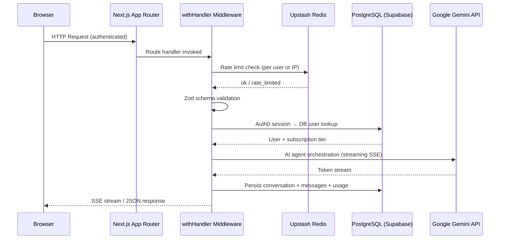
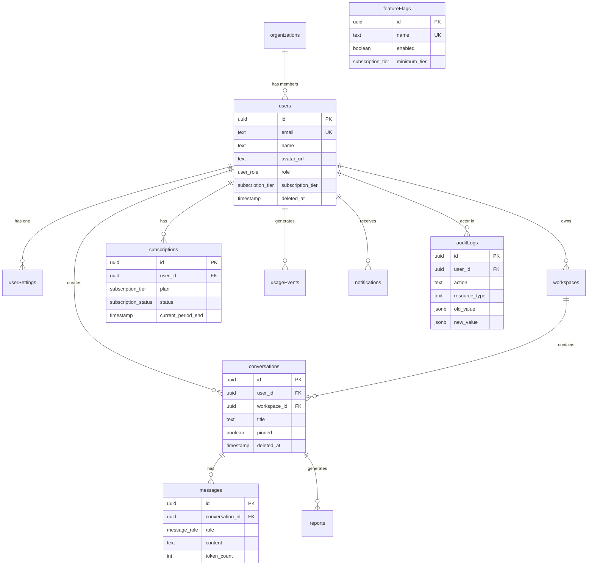

# Architecture — Adviser AI

## System Overview

Adviser AI is a multi-agent AI strategic advisory platform built on Next.js 16 App Router with Google Gemini as the underlying LLM. It uses a layered architecture: a React frontend communicates with Next.js API routes, which orchestrate AI agents and persist data to a PostgreSQL database via Drizzle ORM.

---

## Request Flow



---

## Data Model



---

## AI Agent Pipeline

```
User Query
    │
    ▼
Intent Classifier (Gemini Flash)
    │ Classifies: research / strategy / validation / trend / career / finance / risk / report
    ▼
Agent Router
    │
    ├─► Research Agent     ──► Deep web research + citation scoring
    ├─► Strategy Agent     ──► SWOT/PESTLE/Porter's frameworks
    ├─► Validation Agent   ──► TAM/SAM/SOM + viability scoring
    ├─► Trend Agent        ──► Trend detection + opportunity mapping
    ├─► Career Agent       ──► Career planning + skills analysis
    ├─► Finance Agent      ──► Financial modeling + unit economics
    └─► Risk Agent         ──► Risk registry + mitigation playbooks
                │
                ▼
        Synthesis Agent (assembles multi-agent outputs)
                │
                ▼
        Response Stream (SSE to browser)
                │
                ▼
        DB Persistence (conversation, messages, usage, tokens, cost)
```

---

## Authentication Flow

```
Browser → /auth/login
    │
    ▼
Auth0 Universal Login
    │
    ▼
Auth0 Callback → /auth/callback
    │
    ▼
@auth0/nextjs-auth0 sets encrypted session cookie
    │
    ▼
getSessionFromCookiesAsync() in API routes
    │  (resolves Auth0 session OR custom base64 session cookie)
    ▼
DB lookup by email → internal user ID
    │
    ▼
Request handler proceeds with { userId, email, name }
```

---

## Rate Limiting

All API routes use distributed rate limiting via Upstash Redis:

- **Authenticated users**: keyed on `user:{userId}` → 30 req/min
- **Anonymous/IP fallback**: keyed on `ip:{clientIP}` → 10 req/min
- In-memory fallback is active when Upstash env vars are not set (development only)

---

## File Storage

File uploads (knowledge items, profile pictures) use **Vercel Blob**:

1. Client POSTs file to `/api/knowledge/upload` or `/api/avatar/upload`
2. API validates MIME type and file size
3. `@vercel/blob` stores file and returns a public CDN URL
4. URL is persisted to `knowledge_items.file_url` or `users.avatar_url`

---

## Email (Transactional)

Emails are sent via **Resend** (`lib/email.ts`):

- Welcome emails on first sign-in
- Notification digests
- System alerts

If `RESEND_API_KEY` is not set, all email sends are logged to console (development fallback).

---

## Subscription Tiers

| Tier | Monthly Queries | Reports | Features |
|---|---|---|---|
| Free | 20 | 3 | Basic agents |
| Pro | 200 | 50 | All agents + exports |
| Team | 1,000 | Unlimited | Multi-workspace + API |
| Enterprise | Custom | Custom | White-label + SLAs |

Tier limits are enforced server-side in `lib/agents/tierLimits.ts`.

---

## Security

| Control | Implementation |
|---|---|
| Auth | Auth0 (OAuth 2.0 / OIDC) |
| Rate limiting | Upstash Redis (distributed) |
| Input validation | Zod schemas on all endpoints |
| SQL injection | Drizzle ORM parameterized queries |
| XSS | `react-markdown` without `rehype-raw` |
| Security headers | CSP, HSTS, X-Frame-Options in `next.config.ts` |
| Admin access | Role check in DB (`users.role = admin`) |
| Soft deletes | `deleted_at` timestamp on all user data |
| Audit trail | `audit_logs` table for all sensitive mutations |
